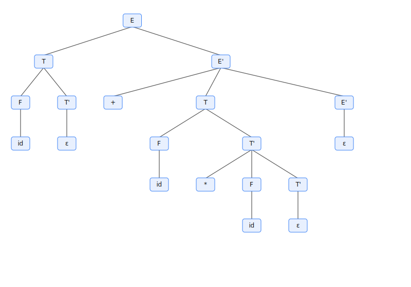
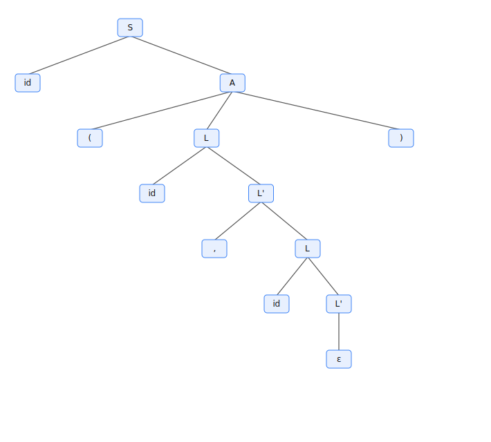
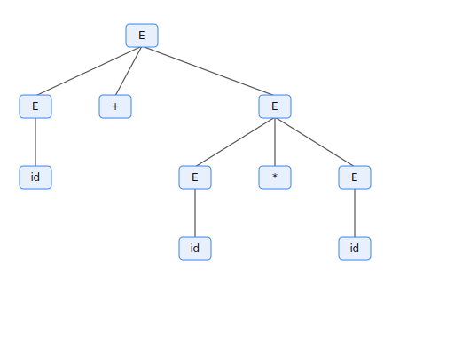
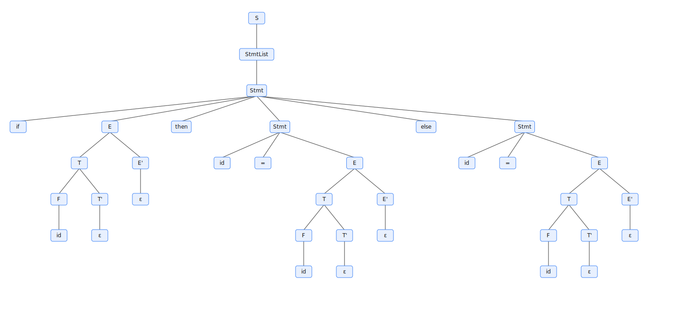
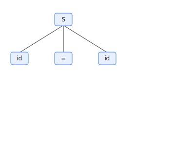

# Compiladores — VisualAutomata (Prof. Luiz Ricardo Mantovani da Silva)

Aplicativo didático para a disciplina de Compiladores, com parsers LL(1)/SLR(1)/LALR(1)/LR(1), GUI integrada (Lexer → Parser → Semântica → IR/TAC → Otimização → Codegen → Simulador), além de Autômatos (RE→NFA→DFA→min) e CFG a partir de TAC.

Identificação
- Disciplina: Compiladores
- Professor: Luiz Ricardo Mantovani da Silva
- Projeto: VisualAutomata (foco em aprendizado prático e visual)

## Guia Rápido
- Executar ambos os parsers no terminal:
  - `python3 parsing_tester.py --grammar expr.txt --input "id + id * id" --method both --trace`
- Abrir GUI com árvore(s) e derivações:
  - `python3 parsing_tester.py --grammar expr.txt --input "id + id * id" --method both --gui`
- Exportar árvore em SVG sem GUI:
  - `python3 parsing_tester.py --grammar expr.txt --input "id + id * id" --method ll1 --export-svg arvore.svg`
  - `python3 parsing_tester.py --grammar expr.txt --input "id + id * id" --method both --export-svg saida.svg` (gera `saida_ll1.svg` e `saida_slr1.svg`)

## Arquivos
- `parsing_tester.py`: script principal (LL(1) e SLR(1) com trace e tabelas).
- `expr.txt`: gramática de exemplo (expressões aritméticas).
- `if_else.txt`: gramática com `if`/`then`/`else`, atribuição e expressões.

## Requisitos
- Python 3.8+
- Nenhuma dependência externa.

## Formato da Gramática
Seções esperadas no arquivo:

```
%Terminals: id + * ( )
%NonTerminals: E E' T T' F
%Start: E
%Productions:
E  -> T E'
E' -> + T E' | ε
T  -> F T'
T' -> * F T' | ε
F  -> ( E ) | id
```

Notas:
- Use `ε` (ou `epsilon`/`eps`) para vazio.
- Tokens no input devem estar separados por espaço. O marcador de fim `$` é implícito.

## Como Executar
Mostra FIRST/FOLLOW, constrói e testa LL(1) e SLR(1):

```
python parsing_tester.py --grammar expr.txt --input "id + id * id" --method both --trace --show-tables
```

Opções úteis:
- `--method ll1 | slr1 | both`: escolhe o(s) método(s).
- `--trace`: exibe passo-a-passo do parser.
- `--show-tables`: imprime tabelas LL(1) e SLR(1) não vazias.
- `--show-items`: lista os itens LR(0) por estado (SLR(1)).
- `--gui`: abre uma janela para visualizar a(s) árvore(s) de derivação aceita(s).
- `--export-svg PATH`: exporta uma imagem SVG da(s) árvore(s) sem abrir GUI.
  - Com `--method ll1` ou `slr1`, salva em `PATH`.
  - Com `--method both`, salva em `PATH` como prefixo e gera `PATH_ll1.svg` e `PATH_slr1.svg`.

## GUI (opcional)
Na GUI:
- Zoom/Pan: use a roda do mouse ou os botões Zoom/Reset; arraste com botão esquerdo para mover.
- Exportar: salve como `SVG` (vetorial) ou `PS` (PostScript). `PNG` é suportado se Pillow estiver instalado.
- Derivação: a aba mostra a sequência de produções aplicada (LL: derivação mais à esquerda; SLR: reduções, que correspondem à derivação mais à direita em ordem reversa).
- Comparação: se ambos (LL e SLR) aceitarem, uma aba "Comparar" mostra as duas árvores lado a lado com suas derivações.

Instalação do Tkinter (para GUI):
- Ubuntu/Debian: `sudo apt-get update && sudo apt-get install -y python3-tk`
- Fedora: `sudo dnf install python3-tkinter`
- Arch/Manjaro: `sudo pacman -S tk`
- macOS (Homebrew): `brew install tcl-tk` e use o Python do Homebrew.
- Windows: geralmente incluso no instalador do Python (python.org).

Verificação rápida:
- `python3 -c "import tkinter; print('tk ok')"`
- (opcional para PNG) `python3 -c "import PIL; print('pillow ok')"`

## Exemplos
- Aceita: `id + id * id`
- Aceita: `( id + id ) * id`
- Rejeita: `+ id id`

Execuções sugeridas:
```
python parsing_tester.py --grammar expr.txt --input "id + id * id" --method ll1 --trace --show-tables
python parsing_tester.py --grammar expr.txt --input "( id + id ) * id" --method slr1 --trace --show-tables --show-items
python parsing_tester.py --grammar expr.txt --input "+ id id" --method both --trace

# Exportar imagem esquemática (SVG) sem GUI
python parsing_tester.py --grammar expr.txt --input "id + id * id" --method ll1 --export-svg arvore.svg
python parsing_tester.py --grammar expr.txt --input "id + id * id" --method both --export-svg saida.svg  # gera saida_ll1.svg e saida_slr1.svg
```

## Saída
- LL(1): tabela preditiva, conflitos (se houver) e trace de derivação.
- SLR(1): ACTION/GOTO, conflitos shift/reduce ou reduce/reduce e trace de desloca/reduz.
- GUI: se `--gui` for usado, exibe as árvores em abas (LL(1) e/ou SLR(1)) com zoom/pan, exportação e a lista de derivações.
- Comparação: se ambos (LL e SLR) aceitarem, uma aba "Comparar" mostra as duas árvores lado a lado com suas derivações.

Exportar Derivações:
- Em cada aba há botões para exportar a sequência de derivações em `TXT` ou `JSON`.

## Observações
- Se a gramática não for LL(1) ou SLR(1), o script ainda reporta conflitos e tentará executar o parser; a aceitação pode falhar.
- Adapte `expr.txt` para testar outras gramáticas no mesmo formato.

## Auto-lexer (opcional)
Para entradas sem espaços, use `--auto-lex`. Ele reconhece:
- Palavras-chave presentes nos terminais (ex.: `if`, `then`, `else`).
- Operadores/pontuação dos terminais (ordem correta inclusive multi-char).
- `id` (identificadores) e `num` (números) se estiverem nos terminais.

Exemplos:
```
# Sem espaços, com auto-lex em expressões
python parsing_tester.py --grammar expr.txt --input "(id+id)*id" --method both --trace --auto-lex

# If/then/else, lista de statements separados por ';'
python parsing_tester.py --grammar if_else.txt --input "if id then id=id; if id then id=id else id=id; id=id+num" --method slr1 --trace --show-items --auto-lex
```

Observação: a gramática `if_else.txt` pode apresentar conflitos (ex.: dangling else) em LL(1) e até SLR(1). O script reporta esses conflitos.

## Precedência e Associatividade
Você pode declarar precedência e associatividade dos terminais para resolver conflitos (similar a Yacc/Bison). Use:

```
%Left + -
%Left * /
%Right ^
%NonAssoc < >
```

Regras:
- Linhas posteriores têm maior precedência que anteriores.
- Conflito shift/reduce: se o lookahead tem precedência maior que a produção, faz shift; menor, faz reduce; igual, usa associatividade (left=reduce, right=shift, nonassoc=erro).
- Conflito reduce/reduce: escolhe a produção de maior precedência (senão mantém a primeira e reporta conflito).

Exemplo em `if_else.txt`:
```
%Left +
%Left *
%Right else
```
Isso favorece deslocar em `else`, ligando-o ao `then` mais próximo; também fixa precedência de `*` sobre `+`.

## Editar Gramáticas e Parâmetros (para alunos)

Esta seção explica como os alunos podem criar/editar gramáticas, escolher a forma de entrada e ajustar parâmetros de execução para estudar e testar.

- Criação/edição:
  - Faça uma cópia de `template_gramatica.txt` (modelo limpo) e renomeie, por exemplo: `minha_gramatica.txt`.
  - Edite as seções `%Terminals`, `%NonTerminals`, `%Start` e `%Productions` conforme seu problema.
  - Se precisar resolver conflitos, adicione linhas de precedência/associatividade: `%Left`, `%Right`, `%NonAssoc`.

- Forma da entrada:
  - Com espaços: forneça tokens exatamente como listados em `%Terminals` (ex.: `id + id * id`).
  - Sem espaços: use `--auto-lex` para tokenização simples (reconhece palavras‑chave, operadores, `id` e `num` se presentes nos terminais).

- Execução básica:
  - `python3 parsing_tester.py --grammar caminho/gramatica.txt --input "..." --method both --trace`
  - Adicione `--show-tables` para ver tabelas LL(1)/SLR(1); `--show-items` para ver itens LR(0) do SLR(1).
  - Para visualizar árvore(s): `--gui`; para exportar sem GUI: `--export-svg saida.svg`.

## Formato da Gramática (detalhado)

Seções esperadas no arquivo (ordem livre, linhas iniciadas por `#` são comentários):

```
%Terminals: lista de terminais
%NonTerminals: lista de não-terminais
%Start: SímboloInicial
%Productions:
A -> α | β | ε
```

Notas úteis:
- Use `ε` (ou `epsilon`/`eps`) para vazio.
- Símbolos usados no lado direito devem aparecer em `%Terminals` ou `%NonTerminals`.
- O marcador de fim `$` é implícito e não precisa ser declarado.

Consulte também o arquivo `template_gramatica.txt` para um modelo comentado pronto para preencher.

## Entrada e Auto‑Lex (sem espaços)

Quando usar `--auto-lex`, o script:
- Reconhece palavras‑chave presentes em `%Terminals` (ex.: `if`, `then`, `else`).
- Reconhece operadores/pontuação listados nos terminais, incluindo operadores de múltiplos caracteres.
- Mapeia números para `num` e identificadores para `id` se ambos estiverem em `%Terminals`.

Exemplos:
```
python3 parsing_tester.py --grammar expr.txt --input "(id+id)*id" --method both --trace --auto-lex
python3 parsing_tester.py --grammar if_else.txt --input "if id then id=id else id=id" --method slr1 --trace --show-items --auto-lex
```

## Parâmetros Principais
- `--method ll1 | slr1 | both`: escolhe o(s) analisador(es).
- `--trace`: passo a passo do parsing.
- `--show-tables`: imprime tabela LL(1) e ACTION/GOTO do SLR(1).
- `--show-items`: lista itens LR(0) por estado (SLR(1)).
- `--gui`: abre GUI com árvore(s) e derivação(ões).
- `--export-svg caminho.svg`: exporta árvore(s) sem GUI; com `both`, gera sufixos `_ll1.svg` e `_slr1.svg`.

## Scripts de Execução

Para facilitar, há scripts prontos no repositório:

- `./run_ll1.sh <gramatica.txt> "tokens..."`: roda LL(1) com `--trace --show-tables`.
- `./run_slr1.sh <gramatica.txt> "tokens..."`: roda SLR(1) com `--trace --show-tables --show-items`.
- `./run_both.sh <gramatica.txt> "tokens..." [--auto-lex]`: roda ambos; opcional `--auto-lex` para entrada crua.

Você pode usá-los diretamente (ou via `bash run_*.sh ...`):
```
./run_ll1.sh expr.txt "id + id * id"
./run_slr1.sh if_else.txt "if id then id = id else id = id"
./run_both.sh expr.txt "(id+id)*id" --auto-lex
```

## GUI Didática
- Inicie a interface: `./run_gui.sh`
- Abas (cobrem as 15 aulas):
  - Lexer: usa o lexer do Lab 02 (quando presente) ou fallback simples.
  - Parser: LL(1)/SLR(1) com `auto-lex`, `trace`, tabelas e itens; visualizar/exportar árvores (SVG).
  - Semântica: digite um mini‑programa (ex.: `x = 1`, `y = x + 2`); checador de tipos do Lab 06.
  - IR/TAC: gera código de 3 endereços a partir da AST do painel de Semântica.
  - Codegen: traduz TAC para assembly didático (toy).
  - Otimização: aplica constant folding e DCE ao TAC.
  - Simulador: executa o assembly produzido (regs e memória).
- Autômatos: constrói NFA (Thompson), converte para DFA (subset), minimiza (Hopcroft), testa cadeias e exporta SVG/DOT.
  - CFG/Grafos: constrói CFG (fluxo de controle) a partir de TAC com `LABEL`/`JMP`/`CJMP`, calcula vivacidade (IN/OUT, USE/DEF) e intervalos lineares.
  - Projeto: instruções para integrar tudo (Aulas 13–14), consulte `CURSO.md`.

Apresentação em sala (sugestão)
- Use o menu “Aulas” para preencher exemplos por tema e o menu “Aulas (auto)” para executar rapidamente as etapas principais.
- Use o menu “Cenas” para salvar estados de demonstração (JSON) e recarregar durante a aula.

## Pipeline Demo (TAC → Regalloc → Codegen → Simulador)
Execute um exemplo completo no terminal:

```
python3 pipeline_demo.py
```

Mostra TAC inicial e otimizado, mapeamento de registradores (linear‑scan k=2), o assembly gerado e o resultado da execução (regs/mem).

## CFG/Liveness Demo
Monte blocos básicos e CFG a partir de TAC com LABEL/CJMP e calcule vivacidade por bloco:

```
python3 cfg_demo.py
```

Imprime blocos, CFG (sucessores), USE/DEF e IN/OUT.

## Autômatos (CLI)
Construa e teste autômatos a partir de regex, exportando NFA/DFA em SVG/DOT:

```
# NFA/DFA a partir da regex, mostrando passos e testando uma cadeia
python3 automata_cli.py --regex "(a|b)*abb" --steps --test abb

# Exportar imagens e DOT
python3 automata_cli.py --regex "a(b|c)+" \
  --export-nfa-svg nfa.svg --export-dfa-svg dfa.svg \
  --export-nfa-dot nfa.dot --export-dfa-dot dfa.dot
```

Na GUI (aba Autômatos): digite a regex, construa NFA/DFA/Min, avance os passos do subset/minimização, teste cadeias e exporte os artefatos.

## Mapa de Aulas (labs)
- Aula 1: `labs/01_intro/` — ambiente, exemplos, GUI/SVG.
- Aula 2: `labs/02_lexica/` — tokens/regex e lexer em Python.
- Aula 3: `labs/03_gramaticas/` — CFG, derivações, árvores, ambiguidades.
- Aula 4: `labs/04_ll1/` — LL(1), FIRST/FOLLOW, fatoração, rec. à esquerda.
- Aula 5: `labs/05_slr1/` — itens LR(0), ACTION/GOTO, precedência.
- Aula 6: `labs/06_semantica/` — AST e verificação de tipos.
- Aula 7: `labs/07_ast_ir/` — TAC (código de 3 endereços).
- Aula 8: `labs/08_codegen/` — codegen; desafio: alocação de registradores.
- Aula 9: `labs/09_opt/` — otimizações (folding, DCE).
- Aula 10: `labs/10_backend/` — assembly e simulador.
- Aula 11: `labs/11_automatos/` — RE→NFA→DFA→min e testes.
- Aula 12: `labs/12_grafos/` — CFG a partir de TAC; extensões de análise.
- Aulas 13–14: `labs/13_projeto/` — projeto integrado.

## GUI — Aulas e Cenas
- Menu “Aulas”: preenche exemplos por aula e navega para a aba correspondente.
- Menu “Aulas (auto)”: além de preencher, executa as ações principais (ex.: Parser executar, TAC gerar, etc.).
- Menu “Cenas”: salve/importe o estado atual (entradas, flags e aba ativa) em JSON.

Atalhos úteis:
- Ctrl+1..Ctrl+0 → Aulas 1..10 (preenche)
- Ctrl+Alt+1..Ctrl+Alt+0 → Aulas 1..10 (preenche e executa)

## Para Alunos
- Pré‑requisitos: Python 3.8+ (Tkinter para GUI).
- Rodar CLI (rápido): veja “Guia Rápido” e “Autômatos (CLI)”.
- Rodar GUI: `./run_gui.sh` (ou `python3 gui_app.py`).
- Dica: comece pelo menu “Aulas” da GUI para navegar pelos temas na ordem do curso.

## Créditos
- Coordenação e autoria didática: Prof. Luiz Ricardo Mantovani da Silva.
- Implementação e material de apoio: VisualAutomata (este repositório), com foco em ensino de Compiladores.

## Roteiro de Exercícios (com explicações)

1) Precedência e associatividade em expressões
   - Objetivo: verificar que `*` tem maior precedência que `+` e ambos associam à esquerda.
   - O que fazer: execute a gramática `expr.txt` em LL e SLR, compare árvores e tabelas.
   - Como fazer:
     - Com espaços: `python3 parsing_tester.py --grammar expr.txt --input "id + id * id" --method both --trace --show-tables`
     - Sem espaços (auto-lex): `./run_both.sh expr.txt "id+id*id" --auto-lex --trace --show-tables`
     - Opcional: `--gui` para ver as árvores; `--export-svg saida.svg` para salvar.
   - O que observar: a árvore deve reduzir `id * id` antes de somar; na tabela LL(1) os acessos não devem ter conflitos; no SLR(1), ACTION/GOTO sem conflitos.

2) Dangling else e resolução com precedência
   - Objetivo: entender o conflito do `else` pendente e como `%Right else` favorece shift.
   - O que fazer: testar `if_else.txt` com e sem a linha `%Right else`.
   - Como fazer:
     - Com precedência: `python3 parsing_tester.py --grammar if_else.txt --input "if id then id=id else id=id" --method slr1 --trace --show-items --auto-lex`
     - Edite a gramática e remova `%Right else`; rode novamente e observe conflitos reportados em SLR(1).
   - O que observar: sem `%Right else`, espere conflito shift/reduce; com `%Right else`, o `else` associa ao `then` mais próximo (shift vence).

3) LL(1): fatoração à esquerda
   - Objetivo: eliminar conflitos na tabela LL(1) usando fatoração.
   - O que fazer: parta de uma gramática não fatorada e reescreva-a fatorando prefixos comuns.
   - Exemplo (antes):
     - `%Terminals: id ( ) ,`
     - `%NonTerminals: S A L`
     - `%Start: S`
     - `%Productions:`
     - `S -> id ( L ) | id`
     - `L -> id , L | id`
   - Problema: `S` tem prefixo comum `id`, gerando conflito em LL(1).
   - Solução (depois):
     - `S -> id A`
     - `A -> ( L ) | ε`
     - `L -> id L'`
     - `L' -> , L | ε`
   - Como fazer:
     - Use os arquivos prontos: `exercicios/ex3_fatoracao_antes.txt` e `exercicios/ex3_fatoracao_depois.txt`.
     - Com espaços (antes): `./run_ll1.sh exercicios/ex3_fatoracao_antes.txt "id ( id , id )"`
     - Com espaços (depois): `./run_ll1.sh exercicios/ex3_fatoracao_depois.txt "id ( id , id )"`
     - Sem espaços (antes): `./run_ll1.sh exercicios/ex3_fatoracao_antes.txt "id(id,id)" --auto-lex`
     - Sem espaços (depois): `./run_ll1.sh exercicios/ex3_fatoracao_depois.txt "id(id,id)" --auto-lex`
     - A tabela LL(1) deve ficar sem conflitos na versão “depois”.
   - O que observar: entradas com e sem parênteses devem ser aceitas; a tabela LL(1) não deve ter múltiplas entradas por célula.

4) LL(1): eliminação de recursão à esquerda
   - Objetivo: tornar uma gramática compatível com LL(1) removendo recursão imediata.
   - O que fazer: reescrever produções do tipo `E -> E + T | T` para forma não recursiva à esquerda.
   - Exemplo (antes):
     - `E -> E + T | T`
     - `T -> T * F | F`
     - `F -> ( E ) | id`
   - Solução (depois):
     - `E -> T E'`
     - `E' -> + T E' | ε`
     - `T -> F T'`
     - `T' -> * F T' | ε`
     - `F -> ( E ) | id`
   - Como fazer:
     - Use os arquivos: `exercicios/ex4_rec_esq_antes.txt` e `exercicios/ex4_rec_esq_depois.txt`.
     - Com espaços (antes): `./run_ll1.sh exercicios/ex4_rec_esq_antes.txt "id + id * id"`
     - Com espaços (depois): `./run_ll1.sh exercicios/ex4_rec_esq_depois.txt "id + id * id"`
     - Sem espaços (antes): `./run_ll1.sh exercicios/ex4_rec_esq_antes.txt "id+id*id" --auto-lex`
     - Sem espaços (depois): `./run_ll1.sh exercicios/ex4_rec_esq_depois.txt "id+id*id" --auto-lex`
   - O que observar: a tabela LL(1) passa a ter entradas únicas e a derivação segue a associatividade esperada.

5) Ambiguidade em expressões e solução via precedência
   - Objetivo: ver conflitos causados por gramática ambígua e resolver com `%Left/%Right`.
   - O que fazer: usar a gramática ambígua clássica e comparar SLR(1) antes/depois das diretivas de precedência.
   - Exemplo ambíguo:
     - `%Terminals: id + * ( )`
     - `%NonTerminals: E`
     - `%Start: E`
     - `%Productions:`
     - `E -> E + E | E * E | ( E ) | id`
   - Como fazer:
     - Com espaços (antes): `./run_slr1.sh exercicios/ex5_ambigua_antes.txt "id + id * id"`
     - Com espaços (com precedência): `./run_slr1.sh exercicios/ex5_ambigua_prec.txt "id + id * id"`
     - Sem espaços (antes): `./run_slr1.sh exercicios/ex5_ambigua_antes.txt "id+id*id" --auto-lex`
     - Sem espaços (com precedência): `./run_slr1.sh exercicios/ex5_ambigua_prec.txt "id+id*id" --auto-lex`
     - Compare as ações ACTION e verifique a resolução dos conflitos.

## Gramáticas dos Exercícios
- Fatoração à esquerda: `exercicios/ex3_fatoracao_antes.txt`, `exercicios/ex3_fatoracao_depois.txt`
- Recursão à esquerda: `exercicios/ex4_rec_esq_antes.txt`, `exercicios/ex4_rec_esq_depois.txt`
- Ambiguidade e precedência: `exercicios/ex5_ambigua_antes.txt`, `exercicios/ex5_ambigua_prec.txt`

## Soluções Esperadas (resumo)
- Exercício 1 (precedência/associatividade):
  - LL(1) aceita e a árvore agrupa `id * id` antes da soma.
  - Em SLR(1) pode haver rejeição dependendo da gramática/base de itens; o foco é a semântica de precedência/associatividade e a tabela LL(1) coerente.
  - Para um SLR(1) determinístico neste cenário, veja o Exercício 5 com diretivas de precedência.
- Exercício 2 (dangling else):
  - Em SLR(1), mesmo com `%Right else`, podem persistir conflitos/rejeição nesta implementação; use as diretivas para observar a intenção (favorecer shift em `else`).
  - Para visualizar a estrutura da árvore, use LL(1) com/sem `%Right else` e compare.
  - A árvore esperada liga `else` ao `then` mais próximo quando `%Right else` está presente.
- Exercício 3 (fatoração à esquerda):
  - Versão “antes”: LL(1) mostra conflito em `M[S, id]` (duas produções); execução pode falhar/rejeitar.
  - Versão “depois”: LL(1) sem conflitos; aceita `id` e `id ( id , id )`.
  - Derivação inclui `A -> ε` na alternativa simples.
- Exercício 4 (recursão à esquerda):
  - Versão “antes”: LL(1) apresenta conflitos ou erro por recursão à esquerda.
  - Versão “depois”: LL(1) aceita; tabelas sem conflitos; derivações usam `E'`/`T'` corretamente.
- Exercício 5 (ambiguidade/precedência):
  - Versão “antes”: SLR(1) com conflitos shift/reduce em `+` e `*` (ACTION reporta conflitos).
  - Com `%Left +` e `%Left *`: conflitos resolvidos; multiplicação tem maior precedência; associatividade à esquerda.
  - Árvore resultante respeita `*` > `+`.
- Exercício 6 (FIRST/FOLLOW e tabelas):
  - LL(1): entradas `M[A,a]` seguem `FIRST(alpha)` e, quando `ε ∈ FIRST(alpha)`, usam `FOLLOW(A)`.
  - SLR(1): reduções aparecem nos lookaheads de `FOLLOW(A)`; `--show-items` evidencia os estados.
- Exercício 7 (sua gramática):
  - Espera-se iteração: ajustar fatoração/recursão/precedência até remover conflitos (LL/SLR) e obter aceitação.
   - O que observar: com as diretivas, o autômato ainda é o mesmo LR(0), mas ACTION resolve conflitos favorecendo `*` sobre `+` e associatividade à esquerda.

6) Explorando FIRST/FOLLOW e tabelas
   - Objetivo: relacionar FIRST/FOLLOW com preenchimento da tabela LL(1) e com FOLLOW nas reduções do SLR(1).
   - O que fazer: habilitar `--show-tables` (LL) e `--show-items` (SLR) e mapear decisões.
   - Como fazer:
     - `python3 parsing_tester.py --grammar expr.txt --input "( id + id ) * id" --method both --show-tables --show-items`
   - O que observar: entradas da tabela LL(1) `M[A,a]` são geradas por `FIRST(alpha)` e, quando `ε` em `FIRST(alpha)`, por `FOLLOW(A)`; no SLR(1) as reduções aparecem em lookaheads de `FOLLOW(A)`.

7) Construindo sua gramática do zero
   - Objetivo: aplicar o ciclo completo (definir tokens, escrever produções, testar, ajustar conflitos).
   - O que fazer: comece do `template_gramatica.txt`, defina sua linguagem, rode ambos os parsers e ajuste com fatoração/eliminação de recursão/precedência.
   - Como fazer:
     - `cp template_gramatica.txt minha_gramatica.txt`
     - Edite os terminais (inclua palavras‑chave/operadores necessários) e produções.
     - Teste: `./run_both.sh minha_gramatica.txt "sua_entrada" --trace` (ou `--auto-lex`).
   - O que observar: use `--trace` para localizar falhas; consulte as tabelas e itens para justificar decisões do parser.

2b) Variante SLR aceitável (subconjunto de atribuição)
   - Objetivo: visualizar uma derivação SLR(1) aceita enquanto o caso com `if/then/else` serve para estudar conflitos.
   - O que fazer: usar um subconjunto mínimo apenas com atribuição.
   - Como fazer:
     - Gramática: `exercicios/ex2_assign_only_slr.txt`
     - Comando: `./run_slr1.sh exercicios/ex2_assign_only_slr.txt "id = id" --trace`
   - O que observar: SLR(1) aceita e gera árvore; compare com os conflitos do exercício 2 para entender a diferença.

## Exemplos SVG
- Exercício 1 (LL(1)): `exemplos_svg/ex1_ll1.svg` (auto-lex: `exemplos_svg/ex1_autolex_ll1.svg`)
- Exercício 3 (LL(1)): `exemplos_svg/ex3_ll1.svg`
- Exercício 5 (SLR(1) com precedência): `exemplos_svg/ex5_slr1.svg`
 - Exercício 2 (LL(1) dangling else): `exemplos_svg/ex2_com_ll1.svg`, `exemplos_svg/ex2_sem_ll1.svg`
  - Exercício 2b (SLR(1) subconjunto atribuição): `exemplos_svg/ex2_assign_only_slr.svg`

- Versões auto-lex adicionais:
  - Exercício 3 (LL(1)): `exemplos_svg/ex3_ll1_autolex.svg`
  - Exercício 5 (SLR(1) com precedência): `exemplos_svg/ex5_slr1_autolex.svg`

Reproduza os SVGs adicionando `--export-svg caminho.svg` aos comandos dos exercícios, ou usando os scripts `run_*.sh` com a mesma opção.

### Visualizações rápidas

<p>
  <a href="exemplos_svg/ex1_ll1.svg"></a>
  <a href="exemplos_svg/ex3_ll1.svg"></a>
  <a href="exemplos_svg/ex5_slr1.svg"></a>
  <a href="exemplos_svg/ex2_com_ll1.svg"></a>
  <a href="exemplos_svg/ex2_sem_ll1.svg"></a>
  <a href="exemplos_svg/ex2_assign_only_slr.svg"></a>
</p>

<p>
  <a href="exemplos_svg/ex1_autolex_ll1.svg"></a>
  <a href="exemplos_svg/ex3_ll1_autolex.svg"></a>
  <a href="exemplos_svg/ex5_slr1_autolex.svg"></a>
</p>

## Dicas e Boas Práticas
- Mantenha os nomes de tokens consistentes entre `%Terminals` e a entrada.
- Garanta que todo símbolo em produções aparece em `%Terminals` ou `%NonTerminals`.
- Use `ε`/`epsilon`/`eps` para vazio; não use `e`/`E` como epsilon (evite colisão com não-terminais como `E`).
- Em caso de rejeição, ative `--trace` para entender onde o parsing falhou.
- Em caso de conflitos no SLR(1), inspecione `--show-items` e ajuste gramática ou precedências.
